<div align="center">


# Playlist Creator

**Convierte el setlist de un concierto en una playlist de YouTube Music en un par de clics.**

Pega la lista de canciones o un enlace de setlist.fm, revisa el resultado y listo: la playlist aparece en tu cuenta.

[](https://ytmusic-playlist-creator-9bub.onrender.com)


<br />

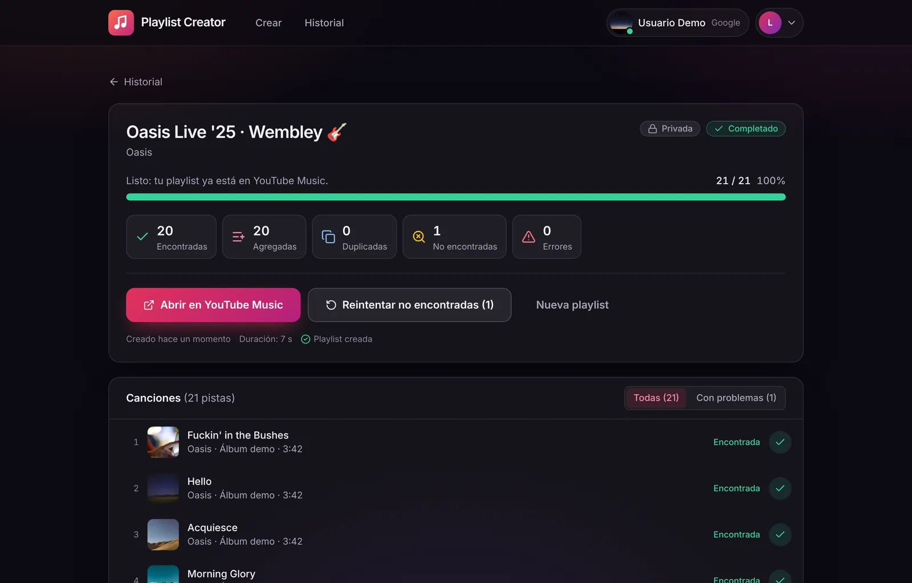

</div>

---

## ✨ Qué hace

| | |
|---|---|
| 🎤 **Desde cualquier setlist** | Pega una lista (`Artista - Canción`, una por línea) o un enlace de [setlist.fm](https://www.setlist.fm). |
| 👀 **Revisas antes de crear** | Vista previa editable: quita canciones, cambia el nombre, la descripción y la privacidad. |
| 🔍 **Busca cada canción** | Encuentra la versión en YouTube Music, evita duplicados y te dice cuáles no encontró. |
| ⚡ **Progreso en vivo** | Ves canción por canción cómo se busca y se agrega, con miniaturas. |
| 🔁 **Reintentos y playlists existentes** | Reintenta las que faltaron o suma canciones a una playlist que ya tienes. |
| 🔐 **Entra con Google** | Un clic para iniciar sesión y conectar tu YouTube, sin copiar nada. |
| 🧩 **API + Postman + CLI** | Todo lo que hace la UI también se puede hacer por API o desde la terminal. |

## 📸 Así se usa

### 1. Entra con tu cuenta de Google

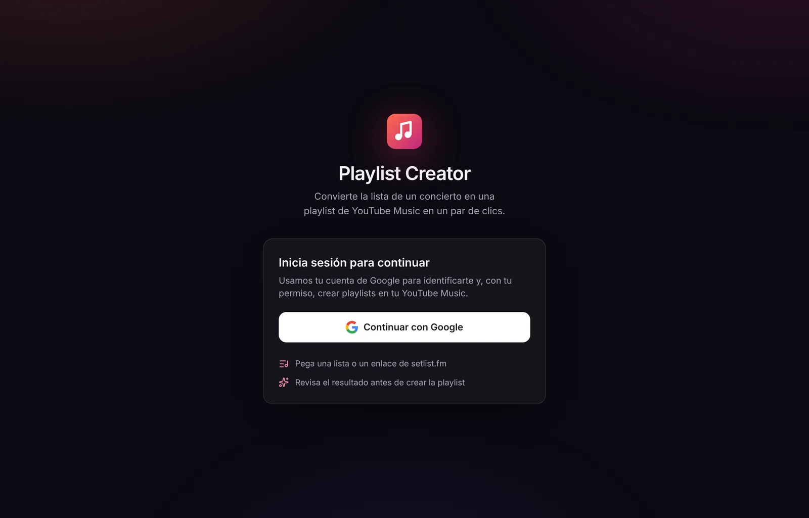

### 2. Conecta YouTube (modo simple, sin copiar nada)

Al entrar con Google autorizas a la app a crear playlists en tu cuenta. Si prefieres, puedes elegir explícitamente el **modo avanzado (cURL)**, útil para listas muy grandes.

<table>
<tr>
<td width="50%">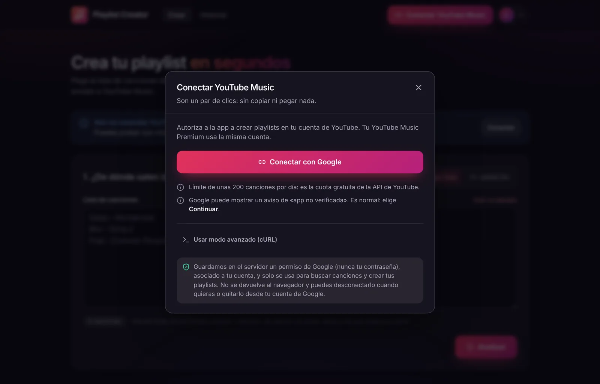</td>
<td width="50%">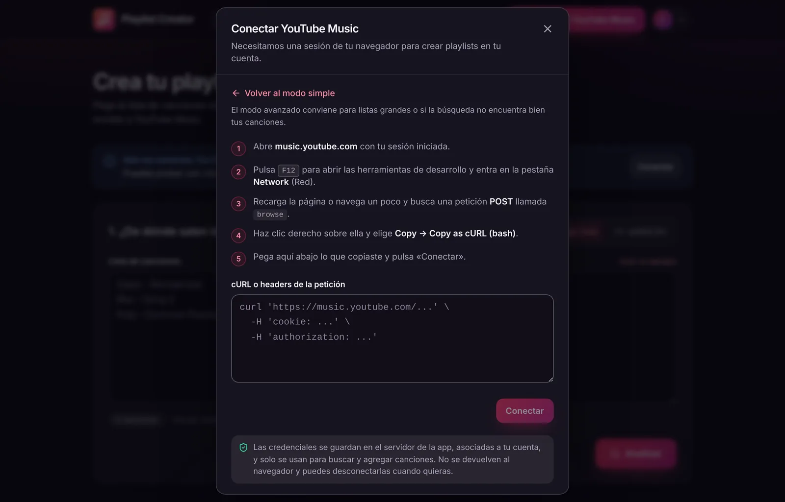</td>
</tr>
<tr>
<td align="center"><sub>Modo simple (predeterminado)</sub></td>
<td align="center"><sub>Modo avanzado (cURL), solo si lo eliges</sub></td>
</tr>
</table>

### 3. Pega el setlist y revisa la vista previa

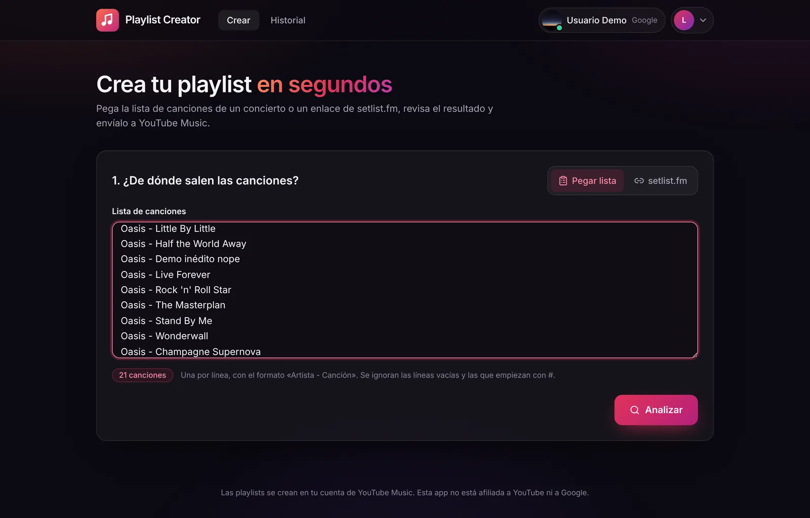

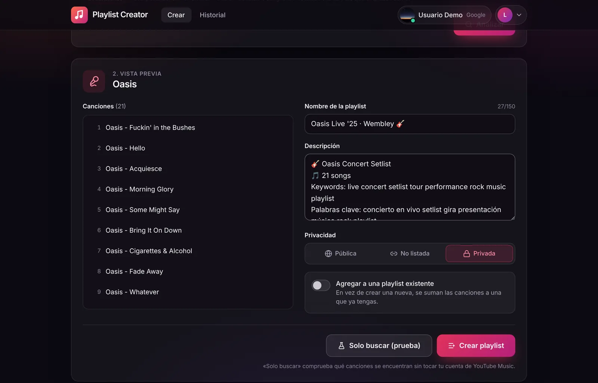

### 4. Mira cómo se arma en vivo

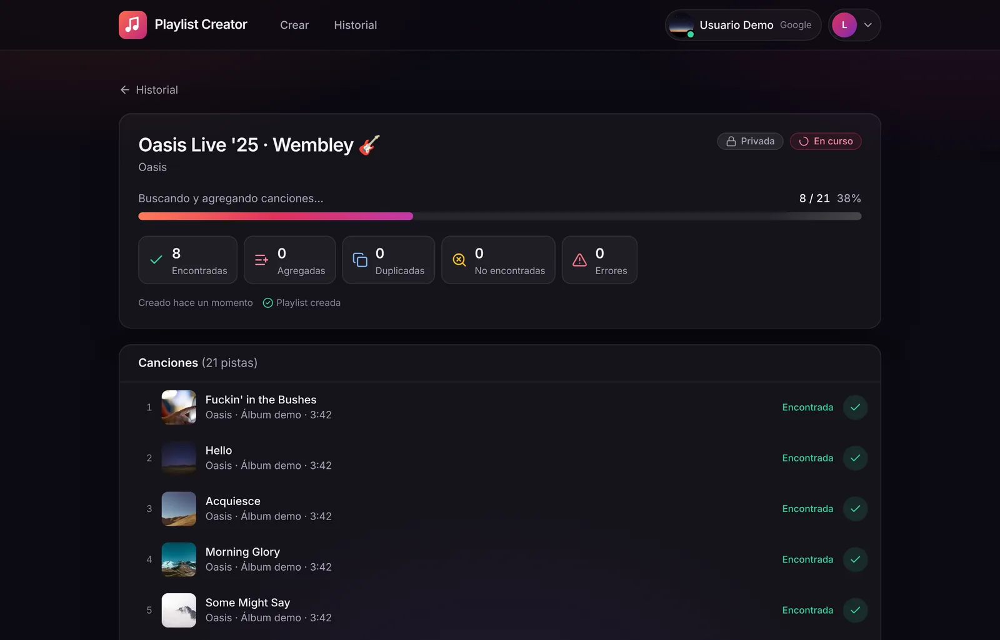

### 5. ¡Lista! Ábrela en YouTube Music

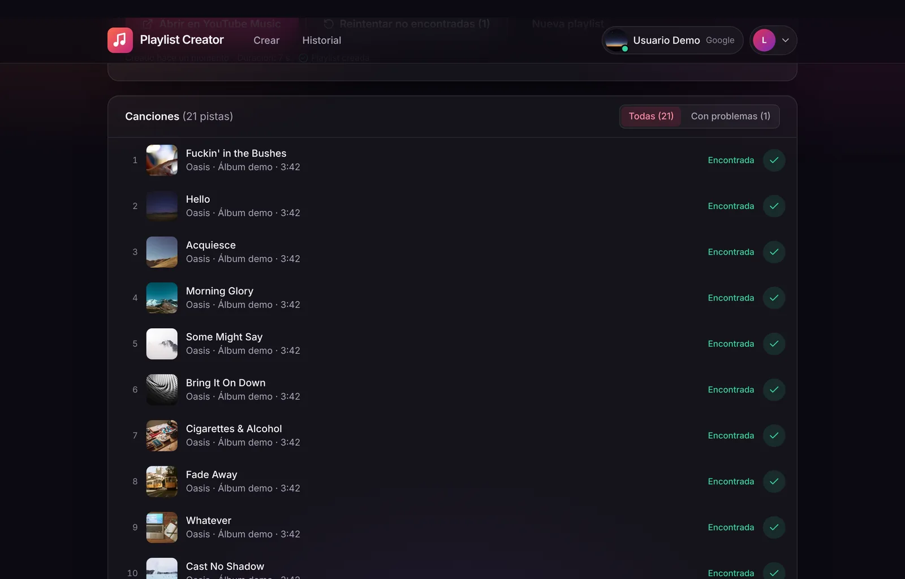

Y todo queda en tu historial:

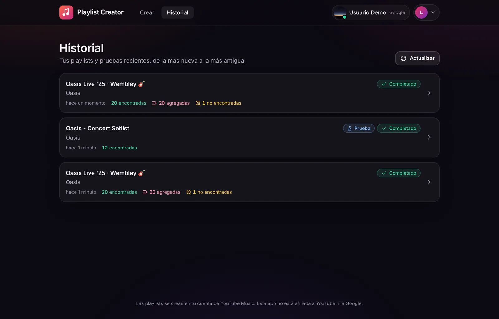

### 📱 También en el celular

<p align="center">
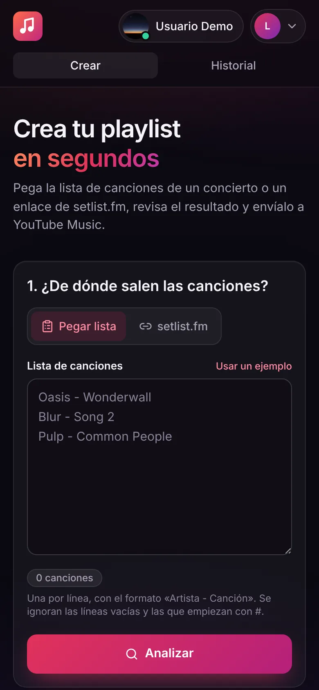
&nbsp;&nbsp;&nbsp;
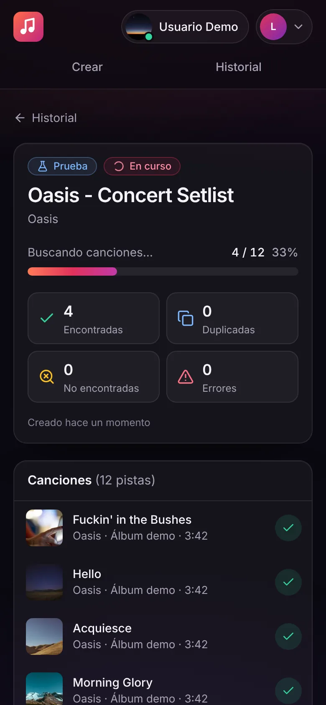
</p>

<sub>Capturas tomadas con Playwright sobre la app real, con YouTube Music simulado.</sub>

## 🧠 Cómo funciona

```
 UI (React)  ·  Postman / curl  ·  CLI
        │              │             │
        └──── API FastAPI ───────────┤   auth (Supabase) · jobs en background
                       │             │
                Núcleo playlist_creator.core
          setlist → búsqueda → playlist en lotes
                       │
        ┌──────────────┴───────────────┐
  Modo simple                    Modo avanzado
  YouTube Data API (Google)      ytmusicapi (cURL del navegador)
```

| Modo | Cómo se conecta | Límite |
|---|---|---|
| **Simple** (predeterminado) | Botón «Conectar con Google» | ~200 canciones por día (cuota gratuita de YouTube) |
| **Avanzado** | Pegas un cURL de music.youtube.com | Sin cuota; ideal para listas grandes |

Las credenciales se guardan **cifradas** en Supabase y nunca vuelven al navegador. Más detalle en [docs/ARQUITECTURA.md](docs/ARQUITECTURA.md).

## 🚀 Úsalo

**En la nube:** [ytmusic-playlist-creator-9bub.onrender.com](https://ytmusic-playlist-creator-9bub.onrender.com). La primera carga puede tardar unos segundos si el servidor estaba dormido.

**En tu computador:**

```bash
python3 -m venv .venv && source .venv/bin/activate
pip install -r requirements.txt
uvicorn playlist_creator.api.main:app --reload      # API en http://localhost:8000 (docs en /docs)

cd frontend && npm install && npm run dev            # UI en http://localhost:5173
```

O simplemente `./run.sh`.

**Por API** (importa [`postman/`](postman/ytmusic-playlist-creator.postman_collection.json) en Postman):

```bash
curl -X POST "http://localhost:8000/api/playlists?wait=true" \
  -H "Content-Type: application/json" \
  -d '{"source": {"type": "songs", "songs": ["Oasis - Wonderwall", "Blur - Song 2"]}, "privacy": "PRIVATE"}'
```

**Desde la terminal:**

```bash
python3 ytmusic_playlist_creator.py -f setlist.txt -n "Mi playlist" -p PRIVATE
python3 ytmusic_playlist_creator.py -u "https://www.setlist.fm/setlist/..." --dry-run
```

## 📚 Documentación

- [Guía completa](README_ES.md): instalación, conexión, variables de entorno y deploy paso a paso en Render + Supabase.
- [Arquitectura y contrato de la API](docs/ARQUITECTURA.md).
- Swagger en `/docs` de la API.

## 🛠️ Stack

**Backend:** Python 3.13, FastAPI, ytmusicapi, YouTube Data API v3, Pydantic · **Frontend:** React 19, Vite, TypeScript, Tailwind CSS 4, lucide · **Infra:** Render (Docker), Supabase (Auth + Postgres), GitHub Actions.

---

<div align="center">
<sub>Hecho con 🎸 para no volver a armar playlists de conciertos a mano. Esta app no está afiliada a YouTube ni a Google.</sub>
</div>
